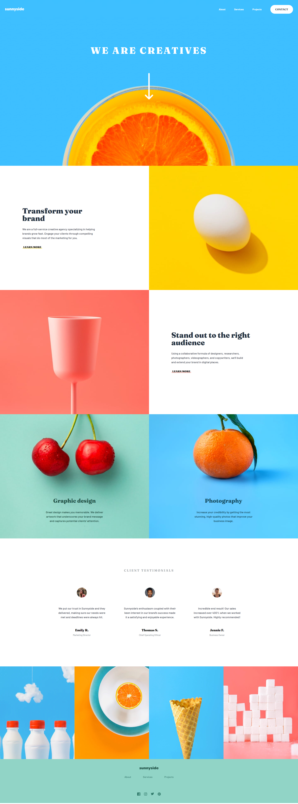

# Frontend Mentor - Sunnyside agency landing page solution

This is a solution to the [Sunnyside agency landing page challenge on Frontend Mentor](https://www.frontendmentor.io/challenges/sunnyside-agency-landing-page-7yVs3B6ef).

## Table of contents

- [Overview](#overview)
  - [The challenge](#the-challenge)
  - [Screenshot](#screenshot)
  - [Links](#links)
- [My process](#my-process)
  - [Built with](#built-with)
  - [What I learned](#what-i-learned)
  - [Continued development](#continued-development)
  - [Useful resources](#useful-resources)
## Overview

### The challenge

Users should be able to:

- View the optimal layout for the site depending on their device's screen size
- See hover states for all interactive elements on the page

### Screenshot

### Links

- Solution URL: [Github](https://github.com/Nipaaaa1/sunnyside-landing-page)
- Live Site URL: [Github Pages](https://Nipaaaa1.github.io/sunnyside-landing-page)

## My process

### Built with

- Semantic HTML5 markup
- CSS custom properties
- Flexbox
- CSS Grid
- Mobile-first workflow
- [React](https://reactjs.org/) - JS library
- [Tailwind CSS](https://tailwindcss.com/) - CSS framework
- [Framer Motion](https://framer.com/motion/) - For animation

### What I learned

This is actually the **First** landing page that I've ever created properly. I'm using *Mobile-First* workflow, developing for mobile first then desktop. It really easier for me to code since *Tailwind CSS* is also *Mobile-First*. I also learn how to use render data into *React* and splitting components on the website.

### Continued development

There's still a lot to do regarding the components, I had to pass some props that actually *not necessary* if only I could use components better. Also I'm thinking about learning another *React Hooks*.

### Useful resources

- [Tailwind CSS Docs](https://tailwindcss.com/docs/installation) - Basically all you need to start using tailwind.
